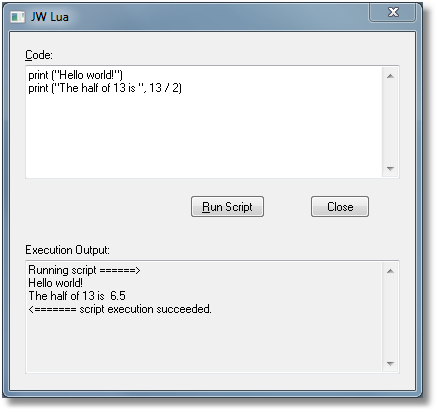

RGP Lua
=======

_RGP Lua_ is an environment to run scripts written in the [Lua Programming Language](https://www.lua.org/) as plugins in the [Finale Music Notation](https://www.finalemusic.com/) program. _RGP Lua_ is free and compatible with all 64-bit versions of Finale. It is the successor to the very successful [JW Lua plugin](https://www.finaletips.nu/index.php/download/category/28-beta-version), which unfortunately ceased being updated in 2017.

Writing scripts for _RGP Lua_ is as simple as setting up a [development environment](/docs/rgp-lua/development-environment) to create a script file (which is a `.lua` text file) and then configuring that file in the [RGP Lua Configuration Window](/docs/rgp-lua/rgp-lua-configuration). The rest of this page describes how to get started and applies to scripts written either for _RGP Lua_ or _JW Lua_ or both (with minor differences noted).

Your First Script
-----------------

Every programming reference seems to require a “Hello, world!” example, so here it is in Lua:

```lua
print ("Hello, world!")
```

If you want a “Hello, world!” example that shows up as a menu option in Finale's Plug-in menu, here is a slightly more complex version:

```lua
function plugindef()
    return "Hello World", "Hello World", 'Displays a message box saying, "Hello, world!"'
end

finenv.UI():AlertInfo("Hello, world!", "")
```

A Quick Start
-------------

The fastest way to get a feel for how the Lua script language works is probably to read and test existing source code material, such as the scripts at [Finale Lua](https://finalelua.com). Make small changes to the script code and try and see what happens when you run it.

PDK Framework
-------------

Both _RGP Lua_ and _JW Lua_ map the Lua script language to the [PDK Framework](https://pdk.finalelua.com) (created by [Jari Williamsson](http://finaletips.nu)). For more info about how to interpret the PDK Framework documentation for scripting in _JW Lua_, please refer to [this page](http://jwmusic.nu//jwplugins/wiki/doku.php?id=jwlua:frameworkdocs "jwlua:frameworkdocs").

All accessible PDK Framework classes starts with the `FC` prefix, such as [`FCMeasure`](https://pdk.finalelua.com/class_f_c_measure.html), [`FCMusicRegion`](https://pdk.finalelua.com/class_f_c_music_region.html), [`FCNoteEntry`](https://pdk.finalelua.com/class_f_c_note_entry.html), etc.

The methods names (and as a result, the Lua properties) in the PDK Framework are in [_UpperCamelCase_](https://en.wikipedia.org/wiki/Camel_case) (sometimes called "Pascal case"). The constants are all-uppercase.

The Lua Language
----------------

_RGP Lua_ as of version 0.67 is based on Lua 5.4. (_JW Lua_ is based on Lua 5.2.) More information about the Lua computer language (and books about Lua) is available at the [Lua](http://www.lua.org/) home page, including [the Lua 5.4 Reference Manual](https://www.lua.org/manual/5.4/) and the online version of ["Programming in Lua", First Edition](http://www.lua.org/pil/). (This book covers Lua 5.0, but for Finale Lua programming purposes, it should cover what you need.)

Lua is case sensitive. The basic Lua syntax is very similar to other computer languages and Lua is an easy language to learn. To be able to write plug-in scripts there are just a few concepts in Lua you need to be aware of, such as:

* Variables
* Tables
* Functions
* Namespaces
* `for … do … end` loops
* `if … then … end` conditional statements

However, to really take advantage of the full power of Lua, there are other very powerful tools (such as iterators, closures, and coroutines) to explore.

Both _RGP Lua_ and _JW Lua_ include all the standard Lua modules (`string`, `math`, `file`, etc). These modules can be used in any Finale Lua script, such as :

```lua
print (math.random(1, 10))
```

### Trusted Code

Lua is a powerful language that has components that allow a script to access many low-level and system-level features outside of the Finale environment. For that reason, users must exercise caution when installing scripts from third party sources. A blatantly destructive script could in theory wreak havoc on your personal files, for example. Neither _RGP Lua_ nor _JW Lua_ offer any way to prevent this, since file system access is an essential productive feature of the plugin. Your operating system files should be safe, but your personal files might not be.

The good news is that in the grand scheme of the internet, Finale is a niche, single-user environment. Only plugins you install will run, and even then they will run only if you invoke them or allow them to be invoked. Consequently there is little motivation for bad actors to create malicious scripts, and the risk is extremely low. As of this writing there have been no reported examples on either _RGP Lua_ or _JW Lua_. Nevertheless, if you are in any doubt, scan the script for uses of `io.write`, `os.remove`, `os.rename`, or other similar calls.

_RGP Lua_ (starting with version 0.67) adds a layer of protection with the concept of trusted code. To gain full access to the language features of Lua and _RGP Lua_, you must be running as trusted. The vast majority of scripts do not need to run as trusted code, and it is recommended not to do so if you do not need to. A script is trusted if

- it is sourced from a known website such as the [Finale Lua](https://www.finalelua.com/) website, and it has not been modified. The Finale Lua organization on GitHub maintains a whitelist of known, trusted websites.
- it is marked "Trusted" in the configurator. The "Trusted" option exists for script developers to mark their own code as trusted. If you are not the developer of the script, do not enable this option. And even if you are, do not enable it unless you have to.

The limitations placed on untrusted scripts are relatively mild. Untrusted scripts cannot

- execute external code.
- load binary C libraries.
- modify Finale's menus.

Note that all scripts can access your file system with user level permission. The main goal of the trusted code restrictions is to limit the ability of a script to remain hidden while taking control of your computer for its own purposes.

### Requesting Code Features

Certain code features must be explicitly requested in the [`plugindef()`](#connect-to-finalelua) function. This allows a user quickly to see the kinds of features the plugin will be using that are unrelated directly to Finale. It also restricts the calls a loaded library can use, which may not be obvious by scanning the top-level script.

Some of the features require trusted code and some do not. A summary is as follows:

- `finaleplugin.ExecuteAtStartup` allows the script to run at startup. It must also be configured as "Allow At Startup", but trusted status is not required.
- `finaleplugin.ExecuteExternalCode` allows the script to launch external code or load binary C libraries. Trusted status is required.
- `finaleplugin.ExecuteHttpsCalls` allows the script to call the `get` or `put` functions in `luaosutils.internet`. Trusted status is not required.
- `finaleplugin.LoadLuaSocket` pre-loads the full `socket` namespace. Trusted status is required.
- `finaleplugin.ModifyFinaleMenus` allows the script to modify Finale's menus. Trusted status is required.

### The 'bit32' namespace

The `bit32` library in Lua 5.2 was removed in Lua 5.4. These functions were replaced with bitwise operators such as `&`, `|`, `>>`, `<<`, etc, directly in Lua. To maintain script interoperability with _JW Lua_ (which includes the `bit32` library as part of Lua 5.2), _RGP Lua_ embeds a [compatible version](https://github.com/finale-lua/lua-source/blob/master/built-in-functions/bit32_for_Lua54.lua) of `bit32` implemented using the Lua 5.4 operators.

### The 'cjson' library

_RGP Lua_ (starting in version 0.67) pre-loads the lua-cjson 2.1.0 library, which is embedded in the plugin. This allows for frictionless encoding of Lua tables to and from JSON strings. Access it as follows:

```lua
local cjson = require('cjson')
```

If you are writing a script to be deployed at the [Finale Lua](https://finalelua.com) website, you must wrap the call to `require` as follows:

```lua
local utils = require('library.utils')
local cjson = utils.require_embedded('cjson')
```

The json strings formatted by cjson are flat, containing no line feeds. If you wish to format them in human-readable format, you can use the built-in function [`prettyformatjson`](#prettyformatjson).

More information on how to use the cjson library is available here:  
[https://www.kyne.com.au/~mark/software/lua-cjson-manual.html](https://www.kyne.com.au/~mark/software/lua-cjson-manual.html)

### The 'finale' namespace

All functionality that accesses Finale through the [Finale PDK Framework](https://pdk.finalelua.com/) resides within the `finale` namespace. (Namespaces use the dot separator.)

For example:

```lua
local page = finale.FCPage()
```

### The 'finenv' namespace

The `finenv` namespace provides “programming shortcuts” to some objects that are often needed for a Finale Lua scripts. For example, you can get the current selection in Finale as follows:

```lua
local sel_rgn = finenv.Region()
```

It also allows for direct interaction with the Lua plugin itself. A full description of available functions and properties can be found on the [finenv properties](/docs/rgp-lua/finenv-properties) page.

### The 'lfs' library

_RGP Lua_ (starting in version 0.68) pre-loads the luafilesystem library ('lfs'), which is embedded in the plugin. This expands access to information about the file system.

```lua
local lfs = require('lfs')
```

If you are writing a script to be deployed at the [Finale Lua](https://finalelua.com) website, you must wrap the call to `require` as follows:

```lua
local utils = require('library.utils')
local lfs = utils.require_embedded('lfs')
```

More information on how to use the lfs libray is available here:  
[https://lunarmodules.github.io/luafilesystem/](https://lunarmodules.github.io/luafilesystem/)

### The 'luosutils' library

_RGP Lua_ (starting in version 0.66) optionally preloads an embedded version of the [`luaosutils`](https://github.com/finale-lua/luaosutils) library. This is a library of functions specifically written to help Lua scripts running on Finale. It allows them to interact with the host operating system or the Finale executable in ways that are not directly supported by either the Lua language or the PDK Framework.

_RGP Lua_ does not load the library into a global namespace, however. You must explicitly `require` it into a varable of your choosing similar to what is shown in the following example.

```lua
local osutils = require('luaosutils')
```

If you are writing a script to be deployed at the [Finale Lua](https://finalelua.com) website, you must wrap the call to `require` as follows:

```lua
local utils = require('library.utils')
local osutils = utils.require_embedded('luaosutils')
```

The advantage to this approach is that you do not need to change the body of your script if you wish to use an external version of `luaosutils` instead of the version embedded in _RGP Lua_. Simply disable the `LoadLuaOSUtils` option in [`plugindef`](#connect-to-finalelua) and the script will pick up the external version instead, provided it is in your `cpath` list. (_RGP Lua_ automatically adds the script’s running folder path to the `cpath` list.)

A script must be running as trusted code to gain full access to the functions in the library. See the [readme file](https://github.com/finale-lua/luaosutils#readme) for details.

### The 'socket' namespace

_RGP Lua_ contains an embedded version of [`luasocket`](https://aiq0.github.io/luasocket/index.html). You can elect for it to be available in the `socket` namespace in one of the following ways.

- Select **Enable Debugging** when you [configure](/docs/rgp-lua/rgp-lua-configuration) your script.
- Add `finaleplugin.LoadLuaSocket = true` to your [`plugindef`](#connect-to-finalelua) function and be running with trusted status.

When you request the `socket` namespace, _RGP Lua_ takes the following actions.

- Preloads `socket.core`.
- Preloads `socket.lua`.
- References ("requires") them together in the `socket` namespace.

If you have only requested debugging, no further action is taken. If you have specified `finaleplugin.LoadLuaSocket = true` in your [`plugindef`](#connect-to-finalelua) function, then _RGP Lua_ takes the following additional actions. (Your script must be running as trusted code.)

- Preloads `mime.core` but does not include it in any namespace. You can access it with

```lua
local mime = require 'mime.core'
```

- Copies the built-in `require` function to a function called `__original_require`.
- Replaces the built-in `require` function with a [new version](https://github.com/finale-lua/lua-source/blob/master/built-in-functions/require_for_socket.lua) that strips the text `socket.` from the beginning of any library name that starts with it. For example:

```lua
local url = require 'socket.url'
```

is converted to

```lua
local url = __original_require 'url'
```

This allows you to manage all the lua sources for `luasocket` in a single flat directory of your choosing. For example, you could require them straight from the `src` directory in a local copy of the [luasocket repository](https://github.com/lunarmodules/luasocket). Or you could easily include them in a distribution package with your script(s).

If you prefer to keep the original `require` function, simply include this line of code before any require statements:

```lua
require = __original_require or require
```

If you are planning to use the standard installation of `luasocket`, you may be better off disabling the embedded version in _RGP Lua_ altogether.

### The 'tinyxml2' namespace

The Lua plugin for Finale has included the `tinyxml2` XML parser for many years. Both _JW Lua_ and _RGP Lua_ use it for reading and saving preference files, among other tasks. It is a lightweight parser implemented as a C++ class framework. It has the advantages of being very fast and possessing a simple API.

Starting with version 0.67 of _RGP Lua_, the `tinyxml2` framework is available to Lua scripts in the namespace `tinyxml2`. You do not need to do anything extra in order to use it.

Example:

```lua
local xml = tinyxml2.XMLDocument()
```

See the [tinyxml2](/docs/rgp-lua/tinyxml2) documentation page for details on how to use it.

### The 'utf8' namespace

Lua 5.4 includes a standard `utf8` library for parsing utf8-encoded strings. With the addition of SMuFL font support in Finale 27, parsing utf8 characters is an essential requirement for Finale scripts. _RGP Lua_ versions before 0.67 embedded a back-ported version of the `utf8` library into Lua 5.2. Since version 0.67 it is part of the standard set of Lua libraries. The [Lua 5.4 Reference Manual](https://www.lua.org/manual/5.4/manual.html) describes how to use these functions.

Dialog Boxes
------------

_JW Lua_ supports dialog boxes to the user through the `finenv.UserValueInput()` call. Programming of these dialog boxes is explained in full detail on [this page](http://jwmusic.nu//jwplugins/wiki/doku.php?id=jwlua:uservalueinput "jwlua:uservalueinput"). However, _RGP Lua_ does not support `UserValueInput`, and it should be considered as deprecated. Use [`FCCustomWindow`](https://pdk.finalelua.com/class_f_c_custom_window.html) or [`FCCustomLuaWindow`](https://pdk.finalelua.com/class_f_c_custom_lua_window.html) instead. These work in _JW Lua_ as well.

Finale Concepts
---------------

When you access Finale data in _RGP Lua_ or _JW Lua_, the data is internally handled in a way that sometimes is very different from how a Finale user experience the data. This section lists some internal concepts in Finale that a Lua programmer for Finale should be aware of.

### Enigma Database

Internally, Finale stores its database, historically called _Enigma data_ which is loaded/saved from/to the database. Different data record types have different access parameters. However, the PDK Framework “hides” all calls to the database through its classes and methods.

Some data (such as the “page spec” record, which describes a page with its width, height, etc) is really simple and has no linked connections to other data in the database. Other types of data demand more, and might consist of linked data records across the database (for example an expression added to the score in Finale, which contains a number of different data records).

### TGF Entry Frame

Note entries however, are not accessed through Finale's usual database calls. They are accessed through a concept called the **TGF entry frame**, where all note entries in a single measure+staff+layer are accessed through one variable-sized data record. The TGF frame can actually be browsed directly in Finale, using Finale's _Edit Frame_ dialog box (in the _Speedy Entry Tool_).

The PDK Framework has no direct representation of the TGF Entry Frame. Container classes such as `FCNoteEntryLayer` and `FCNoteEntryCell` manage the TGFs for you. You must keep in mind that when an instance of one of these container classes goes out of scope and is garbage collected, the TGFs they were maintaining are destroyed as well. If you access any dangling entry instance from a destroyed container, you can crash Finale. This is particularly a risk with the built-in iterators [`eachentry`](https://github.com/finale-lua/lua-source/blob/master/built-in-functions/rgplua_built_in_functions.lua) and [`eachentrysaved`](https://github.com/finale-lua/lua-source/blob/master/built-in-functions/rgplua_built_in_functions.lua). They create and destroy instances of `FCNoteEntryCell` from which they feed entries to the loop. It is very risky to assign one of those entry instances to an external variable and then access it outside the loop.

A note entry can contain multiple notes (which are the different pitches in a chord), but the notes are just sub-data in the note entry.

### Optimization Flags

Finale makes extensive use of bit flags (accessed through class properties in PDK Framework classes) to signal that the data should behave in a certain way.

However, when connecting some data types to measures and note entries, Finale also uses some internal _flags_ to mark if the database should be accessed for the specific measure/entry. These flags are optimization flags, to speed up the performance in Finale. In the PDK Framework, all optimization flags end with `Flag`.

Example: if a note entry has _articulations_, there is a specific optimization flag for them that is accessed through the `FCNoteEntry.ArticulationFlag` property.

### Editing Scope

Finale will edit the document and part that currently has the **editing focus**. Technically, the editing focus might be different from what the user sees on the screen (the _visual focus_), so a script can edit data in a document/part that is not currently visible. However, as a plug-in script programmer, it is extremely important that you make sure that the editing focus and the visual focus are identical when the plug-in script ends.

Class Concepts
--------------

### Collections

An important concept in the PDK Framework is the **collection**. Usually, collection classes ends with a plural 's' version of the “single-object” version. For example:

```lua
measure = finale.FCMeasure()      -- A single measure
measures = finale.FCMeasures()    -- A collection of multiple measures
```

Collections are not compatible with Lua tables, but they can be converted to Lua tables with the `coll2table()` function (see below).

### Cells

A **cell** in PDK Framework termonology is a reference to a single measure on a single specific staff. The concept is used with the [`FCCell`](https://pdk.finalelua.com/class_f_c_cell.html) and [`FCNoteEntryCell`](https://pdk.finalelua.com/class_f_c_note_entry_cell.html) classes, but it affects many other classes as well. The coordinate system for cells (at object creation, for example) always is _x, y_, which in the cell concept means _measure\_number, staff\_number_.

Connect to Finale/Lua
---------------------

To fully integrate a plug-in script with _Finale_ (and _RGP Lua_ or _JW Lua_)—so it behaves like an independent plug-in—the script can describe the script through the `plugindef()` function.

Please note that _JW Lua_ can handle many of the items in the `plugindef()` function automatically, by using _JW Lua’s_ “Plug-in Def” dialog box. With _RGP Lua_ you will need to use a text editor or IDE.

_RGP Lua_ can be further integrated by configuring a [stand-alone](/docs/rgp-lua/standalone-configuration) instance. Stand-alone configuration includes the option to hide _RGP Lua’s_ configuration dialog box so that your scripts appear in Finale’s Plug-ins menu as independent, self-contained plugins. (See the [link](/docs/rgp-lua/standalone-configuration) for more information.) The main target of stand-alone configuration is large-scale FinaleLua projects such as [Perfect Layout](https://elbsound.studio/) and [JetStream Finale Controller](https://jetstreamfinale.com/) that have their own installers that otherwise might interfere with a user’s separate script configuration.

### The 'plugindef()' function

The `plugindef()` function is an optional function that **only** should do a _maximum_ of 2 things:

* Return the _plug-in name_, _undo string_ and _brief description_ to be used in the _Finale_ plug-in menu and for automatic undo blocks.
* Define the `finaleplugin` namespace environment to further describe the plug-in (see below).


A simple `plugindef()` implementation might look like this:

```lua
function plugindef()
    finaleplugin.RequireSelection = true
    finaleplugin.CategoryTags = "Rest, Region"
    return "Hide Rests", "Hide Rests", "Hides all rests in the selected region."
end
```

`plugindef()` is considered to be a reserved name in the global namespace. If the script has a function named `plugindef()`, the Lua plugin may call it at any time (not only during script execution) to gather information about the plug-in. The `plugindef()` function can **NOT** have dependencies outside the function itself.

All aspects of the `plugindef()` are optional, but for a plug-in script that is going to be used repeatedly, the minimum should be to return a plug-in name, undo string, and short description.

The `plugindef()` function can return a maximum of 3 return values (all of them should be strings):

* The **first** return value is the _name_ of the plug-in. On Windows, the `&` character may be used before a letter to specify that letter as a mnemonic character keystroke when the script appears in Finale's plug-in menu. _(Example: “My &Plug-in” would make `p` the shortcut mnemonic key.)_

* The **second** return value is the _undo text_ for the plug-in. _JW Lua_ will append “ \[JW Lua\]” to the undo text when it sends the undo record to Finale. (Note: _RGP Lua_ does not do this.)

* The **third** return value is a _brief description text_ (for the status/message bar in _Finale_ and the _JW Lua_ user interface).


Again, all these return values are optional.

### The 'finaleplugin' namespace

The `finaleplugin` namespace is a reserved and defined namespace for the `plugindef()` execution. It can both contain properties that affect how the script will run and properties that further describes the script to the outside world.

Please note that since the execution of `plugindef()` is completely silent (no errors are displayed on failure), make absolutely certain that all spellings are correct (including correct upper/lower case).

The `finaleplugin` properties should **only** be set in the `plugindef()` function. Both _JW Lua_ and _RGP Lua_ call `plugindef()` immediately before executing the script. Any explicitly configured properties of the `finaleplugin` namespace are therefore available to the script when it starts executing. (Omitted properties are not available and return `nil`.)

The properties are discussed in details on the [finaleplugin properties](/docs/rgp-lua/finaleplugin-properties) page.

print() Redirection
-------------------

_JW Lua_ redirects the output of the standard Lua `print` function to the _JW Lua_ window, so all output from the `print` function shows up there:



_RGP Lua_ has no output window, but there are a number of ways to see output from the `print` function.

* Redirect it to an external debugger. See instructions for setting up a [Development Environment](/docs/rgp-lua/development-environment) for more details. (This works on both `macOS` and `Windows` and is the recommended approach with _RGP Lua_.)
* Debug Finale under XCode on `macOS`. The `print` output appears in XCode's “Output” window.
* Run Finale from a `macOS` Terminal prompt. The `print` output appears in the Terminal window.

Additional Finale Lua Functions
-------------------------------

_RGP Lua_ and _JW Lua_ add some some functions to the global namespace that are specially designed for plug-in script programming. They are listed below:

### coll2table()

`coll2table()` transforms a PDK Framework collection object into a Lua-style table, so the items can be used with the Lua standard functions for tables (such as the standard `table.` library). The resulting table is 1-based (not 0-based as the PDK Framework collections). For example:

```lua
-- Load all measure objects
allmeasures = finale.FCMeasures()
allmeasures:LoadAll()
-- Convert to table
measuretable = coll2table(allmeasures)
-- Sort the measure objects according to their width (widest measure first)
table.sort(measuretable, function (a,b) return (a.Width > b.Width) end)
-- Print the sorted result
for i, v in ipairs(measuretable) do
   print ("Item", i, "is measure number", v.ItemNo, "with the width", v.Width)
end
```

### dumpproperties()

`dumpproperties()` creates a table consisting of all available properties for an object and their values. The keys in the table is the property names; the values in the table are the property values. Use the `pairsbykeys()` iterator (see below) to get the properties sorted in alphabetical order.

The first parameter to the function is an instance of a PDK Framework class.

The second parameter is optional, but can be used to specify if properties from base classes should be included as well. If omitted, properties from base classes are not included.

```lua
page = finale.FCPage()
page:Load(1)
properties = dumpproperties(page, true) -- true: include base class properties
for k, v in pairsbykeys(properties) do
   print (k, "=", v)
end
```

### each()

`each()` is the general iterator “factory” for PDK Framework collection objects. It feeds the `for` loop with all the elements of the collection:

```lua
-- Print the widths for all the pages
allpages = finale.FCPages()
allpages:LoadAll()
for v in each(allpages) do
     print ("Page", v.ItemNo, "has the width", v.Width)
end
```

### eachbackwards()

`eachbackwards()` does the same as the `each()` iterator, but parses the elements backwards starting from the end of the collection. It feeds the `for` loop with all the elements of the collection. This iterator is available in beta version 0.31 and later.

```lua
-- Print the widths for all the pages, starting from the last page
allpages = finale.FCPages()
allpages:LoadAll()
for v in eachbackwards(allpages) do
     print ("Page", v.ItemNo, "has the width", v.Width)
end
```

### eachcell()

`eachcell()` feeds a `for` loop with all the cell coordinates for a region. Partially selected measures are treated as being selected. The first coordinate is the measure, the second is the staff ID. `eachcell()` requires a region as the parameter, and an easy way is to refer to `finenv.Region()` to get the currently selected region.

Example:

```lua
for m, s in eachcell(finenv.Region()) do
   print ("Measure: ", m, "Staff: ", s)
end
```

### eachentry()

`eachentry()` feeds a `for` loop with all the note entry objects in a region, without saving them back. Mirror entries are processed with `eachentry()`.

The first parameter to this function is the region to process, where you could use `finenv.Region()` to get the current selection.

The second parameter is optional, but can be used to indicate the note entry layer(s) to load in Finale. The default is to load all visible layers. These values are available:

| Value | Description |
| --- | --- |
| -3  | Don't load any entries. |
| -2  | The non-visible layers(s). |
| -1  | All layers, regardless if they're visible or not. |
| 0   | All visible layer(s). This is the default. |
| 1 through 4 | Load only the one-based layer number. The layer is loaded regardless of the layer visibility. |
| A bit mask combination of hex values `0x100`, `0x200`, `0x400`, `0x800` | The layers 1-4 in any combination. |

Example:

```lua
counter = 0
for e in eachentry(finenv.Region()) do
   if e:IsRest() then
      counter = counter + 1
   end
end
print ("The region contains", counter, "rest entries.")
```

A word of caution when using `FCNoteEntry.Next` and `FCNoteEntry.Previous`. `eachentry()` and `eachentrysaved()` iterate one measure at a time. If you need the `Next` and `Previous` methods to cross barlines, use the `each()` iterator with `FCNoteEntryLayer` instead.

### eachentrysaved()

`eachentrysaved()` feeds a `for` loop with all the note entry objects in a region and automatically saves the entries back to Finale after processing. Only use this function when the entries actually needs to be saved. It requires the same parameter(s) as `eachentry()` (see above). Mirror entries are _not_ processed with `eachentrysaved()`.

One other task that can be automatically done with `eachentrysaved()` is to delete entries. Just set the duration to 0, and `eachentrysaved()` will automatically delete the entry prior to saving it.

```lua
-- Let eachentrysaved() delete all rests in the selected region
for e in eachentrysaved(finenv.Region()) do
   if e:IsRest() then e.Duration = 0  end
end
```

Due to the way the TGF frame works, the note entry is not saved directly after each loop turn, but only when a frame has been fully processed.

### eachstaff()

`eachstaff()` feeds a `for` loop with all the staves for a region, from top to bottom. 
Iterating staves by number is a bit tricky, since Finale increments staff numbers as they
are added, rather than in score order. This function encapsulates that logic. `eachstaff()` requires a region as the parameter, and an easy way is to refer to `finenv.Region()` to get the currently selected region.

Example:

```lua
for s in eachstaff(finenv.Region()) do
   print ("Staff: ", s)
end
```

`eachstaff()` was added in version 0.63 of _RGP Lua_ and is not available in _JW Lua_.

### loadall()

`loadall()` feeds a `for` loop with the elements from a collection, typically where the data hasn't been loaded. The supplied collection must support the `LoadAll()` method. This is a useful shortcut when the collection itself isn't important, but rather all the items in the collection.

Example:

```lua
for m in loadall(finale.FCMeasures()) do
   print ("Measure width: ", m.Width)
end
```

### loadallforregion()

`loadallforregion()` feeds a `for` loop with the elements from a collection, based on a region. The first argument is a created collection, typically without any loaded objects. The second argument is the region.

The supplied collection must support the `LoadAllForRegion()` method. This is a useful shortcut when the collection itself isn't important, but rather all the items in the collection.

Example:

```lua
local region = finenv.Region()
for e in loadallforregion(finale.FCExpressions(), region) do
   print ("Expression's measure:", e.Measure)
end
```

### pairsbykeys()

`pairsbykeys()` feeds a `for` loop with the table elements, where the elements appear sorted by key. It returns the key/value pair just like the `pairs()` iterator in _Lua_.

Example:

```lua
t = {}
t["test"] = 12
t["a test"] = 100
for k, v in pairsbykeys(t) do
   print (k, "=", v)
end
```

### prettyformatjson()

`prettyformatjson()` formats a flat json string into a tabbed, formatted string containing multiple lines. The first argument is the string to process. An optional second argument can supply the number of spaces to use as tab width. If omitted, the function defaults to 3 spaces.

```lua
t = {} -- your table
local cjson = require('cjson')
local json_string = cjson.encode(t)
if json_string then
   local pretty_json = prettyformatjson(json_string) -- using the default tab width of 3
   -- OR --
   local pretty_json = prettyformatjson(json_string, 4) -- supplying the tab width, in this case, 4
end
```

If the input string is not json, or if it already is formatted, the output results are not predictable.

### xml functions

See the [tinyxml2](/docs/rgp-lua/tinyxml2) documentation page for details on other built-in functions available starting with v0.67 of _RGP Lua_ .


Memory Management
-----------------

The Lua language handles memory through garbage collection, so allocated memory is released automatically by Lua. However, there are a couple of points that a plug-in programmer should be aware of.

* Define variables as `local` as often as possible. This becomes particularly important when group scripts (_JW Lua_ only) are used (global variables survive to the subsequent scripts in the group as well), or when using libraries. However, if you are using `finenv.RetainLuaState` in _RGP Lua_, keep in mind that `local` variables can disappear between invocations of the script. Any cross-invocation state should be held in global variables.
* The memory allocated by the PDK Framework's `Create` methods is handled automatically in different ways by _RGP Lua_ and _JW Lua_. _JW Lua_ releases these memory objects _after_ the full script has been run. _RGP Lua_ allows the Lua engine to release them as part of normal Lua garbage collection.
* For _JW Lua_, the `Create` methods can sometimes result in a huge number of objects waiting for release, for example, in a tight loop. `Lookup` classes (classes that end with `Lookup`) are available as a faster and more memory-efficient approach.
* For _RGP Lua_, calling `Create` methods in tight loops is less of an issue, since Lua garbage collection releases unused items as the loop progresses. However the same `Lookup` classes are supported as in _JW Lua_.
* When using the `FCCellMetrics` or `FCEntryMetrics` class, make sure to call the `FreeMetrics()` method separately for the loaded object as soon as the data is no longer is needed. Finale allocates loaded metrics data internally, and metrics with a garbage collector can otherwise impact performance in scripts where lots of metrics data are loaded without release. This is not as big of an issue in _RGP Lua_ because Lua garbage collection also releases the internal metrics data, but `FreeMetrics()` still gives you the control to free it as soon as you no longer need it. Metrics also allow the `<close>` keyword in Lua 5.4, which calls `FreeMetrics()` automatically when the variable goes out of scope.

Tips
----

* If you don't need a collection object anymore, you can set it to `nil`. That might benefit the performance in large scripts with huge collections of data (since it signals to the garbage collector that it can free the allocated memory).
* _RGP Lua_ uses Lua 5.4, which includes the `<close>` keyword. Most of the collection classes in the PDK Framework support `<close>`. (See the [documentation](https://pdk.finalelua.com).) If you define your collection instances with `<close>`, they free their memory as soon as they go out of scope.
* There is virtually no performance penalty to put lots of comments in the script code. Once the script has been loaded into the Lua engine, the code resides in (quite efficient) bytecode where only the actual execution code appears.
* An alternative syntax for properties is to use the property name as a string table index with the object as a table. For example, the syntax `mymeasure.Width` is equivalent to `mymeasure["Width"]`. This alternative syntax might be useful when referencing properties dynamically through the code, especially in string variables. Example:

```lua
function print_property(obj, property_name)
    print(tostring(obj[property_name]))
end

print_property(mymeasure, "Width")
```

(Most of this content was copied from [Jari Williamsson's site](http://jwmusic.nu/jwplugins/wiki/doku.php?id=jwlua:development) and will be removed or revised if so requested.)
