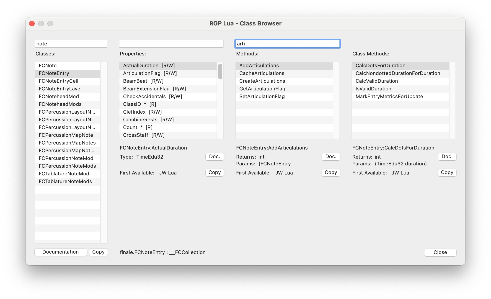

RGP Lua Class Browser
=====================

The RGP Lua Class Browser is a re-implementation in pure Lua of the Class Browser in _JW Lua_. It displays the available classes from embedded C++ frameworks, along with their methods and properties. As of version 0.68 of _RGP Lua_, the embedded C++ frameworks are:

- `finale` : the classes in the [PDK Framework](https://pdk.finalelua.com/) for Finale.
- `tinyxml2` : the classes in the [tinyxml2](/docs/rgp-lua/tinyxml2) library.

The Class Browser is included as `rgpluaclassbrowser.lua` in the zip archive of RGP Lua Utilities available on the [download page](https://robertgpatterson.com/-fininfo/-rgplua/rgplua.html) for RGP Lua.

The `rgpluaclassbrowser.lua ` script requires version 0.56 or higher of _RGP Lua_. It also requires the `jwluatagfile.xml` from the zip file. Other than that it has no dependencies. You may place the two files together anywhere on your hard drive. Once you have [configured](/docs/rgp-lua/ the `.lua` file in RGP Lua, it will be available to run.

The edit boxes across the top allow you to filter classes, properties, and methods. The filter is case-insensitive and finds the filter text anywhere in the name. In the example you can see that a filter of "note" has found every class whose name includes the word "note", ignoring case.

**Class Documentation** This button launches a browser to the page for the class on the [PDK Framework](https://pdk.finalelua.com/) website.

**Doc.** The `Doc.` buttons launch a browser to the specific method page that is selected in their respective columns. The `Doc.` button for properties launches the page for the property getter method.

---

### The 'jwluatagfile.xml' File

---

You can run the any version of RGP Lua Class Browser with any version of _RGP Lua_ from 0.56 on. However, for best results you should always run with the latest version of `jwluatagfile.xml`. It is the version that matches the links on the [PDK Framework](https://pdk.finalelua.com/) website.

The latest version (and the version that matches the PDK website) is always available at the [download site](https://robertgpatterson.com/-fininfo/-rgplua/rgplua.html) in the RGP Lua Utilities zip file link.
