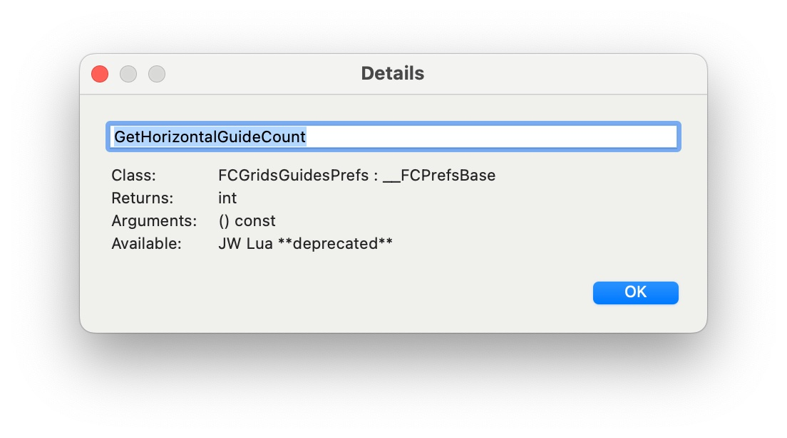

RGP Lua Class Browser
=====================

The RGP Lua Class Browser is a re-implementation in pure Lua of the Class Browser in _JW Lua_. It displays the available classes from embedded C++ frameworks, along with their methods and properties. As of version 0.70 of _RGP Lua_, the embedded C++ frameworks are:

- `finale` : the classes and constants in the [PDK Framework](https://pdk.finalelua.com/) for Finale.
- `finenv` : the methods and properties in the [finenv](https://www.finalelua.com/docs/rgp-lua/finenv-properties) namespace.
- `tinyxml2` : the classes and constants in the [tinyxml2](/docs/rgp-lua/tinyxml2) library.

The Class Browser is included as `rgpluaclassbrowser.lua` in the zip archive of RGP Lua Utilities available on the [download page](https://robertgpatterson.com/-fininfo/-rgplua/rgplua.html) for RGP Lua.

The `rgpluaclassbrowser.lua ` script requires version 0.56 or higher of _RGP Lua_. It also requires the `jwluatagfile.xml` from the zip file. Other than that it has no dependencies. You may place the two files together anywhere on your hard drive. Once you have [configured](/docs/rgp-lua/rgp-lua-configuration) the `.lua` file in RGP Lua, it will be available to run.

The edit boxes across the top allow you to filter classes, properties, and methods. The filter is case-insensitive and finds the filter text anywhere in the name. In the example you can see that a filter of "note" has found every class whose name includes the word "note", ignoring case.

Starting with _RGP Lua v.70_, the class browser shows deprecation status and first available version for methods and properties. These are based on the [PDK Framework](https://pdk.finalelua.com) documentation and are only as accurate as the documentation is. However, every effort is made to keep the documentation correct and current.

**Class Documentation** This button launches a browser to the page for the class on the [PDK Framework](https://pdk.finalelua.com/) website.

**Doc.** The `Doc.` buttons launch a browser to the specific method page that is selected in their respective columns. The `Doc.` button for properties launches the page for the property getter method.

**Copy** The `Copy` button copies the currently selected item to the clipboard. Items in the `Classes	` column are prepended with the namespace. Items in the `Class Methods` column are prepended with namespace and class name. The goal is to be able to insert them directly into a script without any additional typing. You can also use `cmd+C` (macOS) or `ctrl-C` (Windows) instead of pressing this button.

**Double clicking** an item or pressing the **Enter Key** while an item is selected brings up the [Details](#details-dialog) dialog box for that item.

---

### Keyboard commands

---

The list boxes in the Class Browser respond to the standard OS keystrokes for navigation: up arrow, down arrow, home, end, etc. You can also type an initial letter and it jumps to the first item starting with that letter.

In addition, the Class Browser list boxes respond to the following keystrokes:

- **Copy**:  `cmd+C` (macOS) `ctrl+C` (Windows)
- **Select Item**: `Enter` (brings up the [Details](#details-dialog) dialog box.)

---

### The 'jwluatagfile.xml' File

---

You can run the any version of RGP Lua Class Browser with any version of _RGP Lua_ from 0.56 on. However, for best results you should always run with the latest version of `jwluatagfile.xml`. It is the version that matches the links on the [PDK Framework](https://pdk.finalelua.com/) website.

The latest version (and the version that matches the PDK website) is always available at the [download site](https://robertgpatterson.com/-fininfo/-rgplua/rgplua.html) in the RGP Lua Utilities zip file link.

---

### Details Dialog

---

The Details Dialog appears when you select an item in one of the list boxes, either with the `Enter` key or by double clicking. It shows the same information as the column under the list box, but it is wide enough to show the complete information for argument lists and return types.

The editable text field is initialized with the same value that the Copy button would copy to the clipboard. You can edit it to anything you wish and then copy it from there.

The rest of the dialog shows static information about the class or method. This information is gathered from the `jwluatagfile.xml` file as well as internal metadata that _RGP Lua_ provides to the Lua environment. In particular, _RGP Lua_ (starting with v0.70) provides the following metadata about each method or property directly:

- deprecation status
- first available _RGP Lua_ version or blank if it was available in _JW Lua_

These values are manually maintained based on the [PDK Framework](https://pdk.finalelua.com/) documentation. Every effort is made to keep them current and accurate, but they should be treated as information only. Do not use these to control program flow as there are more reliable approaches to determine the availability of a particular method or property inside your scripts. (The most straightforward is checking it for `nil`.)
