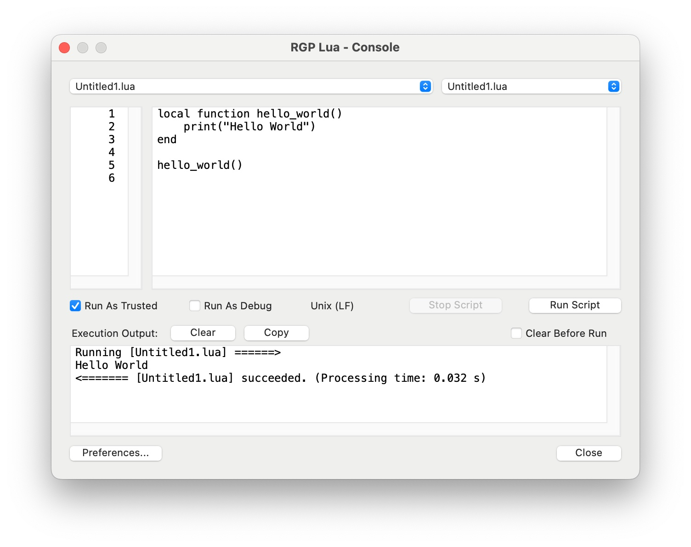
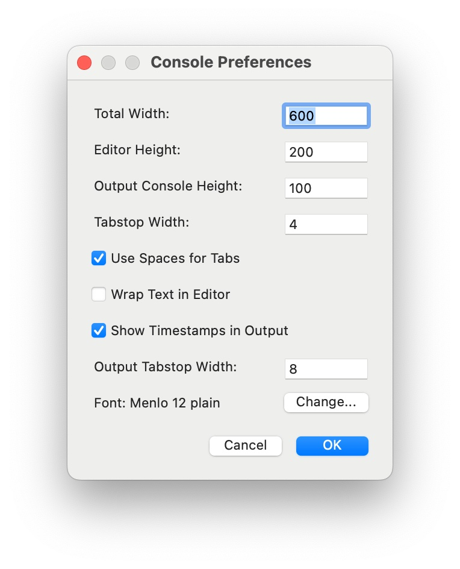
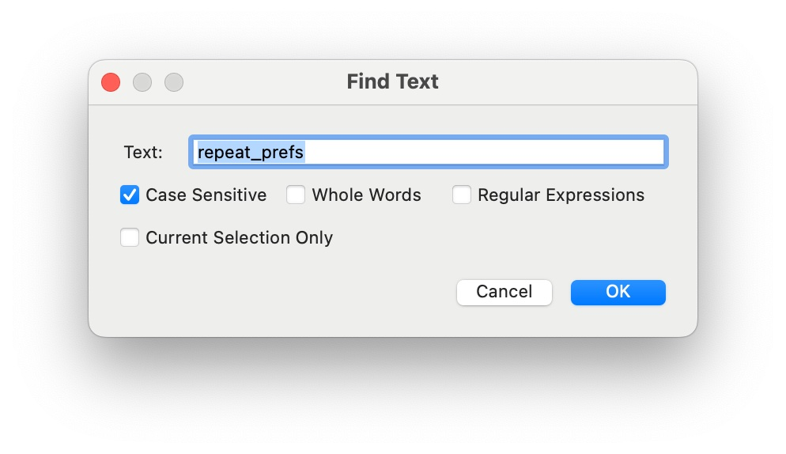

RGP Lua Console
===============

The RGP Lua Console is a re-implementation in pure Lua of the Developer Tab in _JW Lua_. It allows you write and/or execute ad hoc scripts or scripts that have not been configured in the [RGP Lua Configuration Window](/docs/rgp-lua/rgp-lua-configuration). It is included as `rgpluaconsole.lua` in the zip archive of RGP Lua Utilities available on the [download page](https://robertgpatterson.com/-fininfo/-rgplua/rgplua.html) for RGP Lua.

The `rgpluaconsole.lua` script requires version 0.68 or higher of _RGP Lua_. Other than that it has no dependencies. You may place it anywhere on your hard drive. Once you have [configured](/docs/rgp-lua/rgp-lua-configuration) it in RGP Lua, it will be available to run.

**Left Popup** A file menu, including `New`, `Open`, `Save`, `Save As`, `Close`, `Close All`, and recent files.

**Right Popup** A menu of all the ways the script can be run. If the script includes [Additional Menu Options](/docs/rgp-lua/finaleplugin-properties#additional-menu-options), they are listed here.

**Run As Trusted** Runs the script in trusted mode. The console itself must be configured as Trusted for this option to be available.

**Run As Debug** Runs the script in Debug mode.

**Line Endings** Displays the line endings of the current script file as one of three options:

- Unix (LF)
- DOS (CRLF)
- MacOS (CR)

**Stop Script** This button is available if the script is running a modeless dialog or has retained its Lua state. By pressing it, you can terminate the script immediately.

**Run Script** Executes the script and displays print output in the output console.

**Clear** Clears the output console.

**Copy** Copies the contents of the output console to the clipboard.

**Clear Before Run** Tells the console to clear itself each time your press Run Script.

**Preferences** Opens the [Preferences Dialog](#preferences-dialog).

**Search** Opens the [Find Text Dialog](#find-text-dialog). If you hold down the shift key while clicking, it finds the next occurence of the text without opening the dialog.

---

### Keyboard Commands

---

The Console recognizes standard keyboard navigation commands for each operating system. It also recognizes the following:

#### File Popup Shortcuts

- **New File**: `cmd+N` (macOS) `ctrl+N` (Windows)
- **Open File**: `cmd+O` (macOS) `ctrl+O` (Windows)
- **Save File**: `cmd+S` (macOS) `ctrl+S` (Windows)
- **Close File**: `cmd+W` (macOS) `ctrl+W` (Windows)

#### Search Shortcuts

- **Find Text**: `cmd+F` (macOS) `ctrl+F` (Windows)
- **Find Again**: `cmd+G` (macOS) `ctrl+G` (Windows)

#### Edit Shortcuts

- **Cut**:  `cmd+X` (macOS) `ctrl+X` (Windows)
- **Copy**:  `cmd+C` (macOS) `ctrl+C` (Windows)
- **Paste**:  `cmd+V` (macOS) `ctrl+V` (Windows)

---

### Working With An IDE

---

The RGP Lua Console works well in tandem with both ZeroBraneStudio and Visual Studio Code. For more information about how to set these up, see instructions for the [Development Environment](/docs/rgp-lua/development-environment). Some items to keep in mind are

- Both IDEs as well as the RGP Lua Console detect changes made by external programs and update their windows automatically when changes occur. However it is a good idea to save edits made in one editor before transitioning to another. Most editors, including RGP Lua Console, do not overwrite their contents if the contents have not been saved. This can lead to being out of sync with other editors.
- ZeroBraneStudio does not allow edits while the script is running in debug mode. If you make external edits while it is running, you can get out of sync with ZeroBraneStudio.
- If your script contains the necessary extra code to trigger your IDE's debugger, you can initiate a debug session from the `Run Script` command of RGP Lua Console. More information about the extra code needed is at the [development environment](/docs/rgp-lua/development-environment) page.

A particularly effective approach is to edit scripts with your IDE editor and use the console to trigger their execution. The console picks up saved changes from the IDE nearly instantaneously. This approach obviates the need to configure scripts in the [RGP Lua Configuration Window](/docs/rgp-lua/rgp-lua-configuration). Having both windows open side-by-side makes for very rapid code-and-test iteration.

---

### Preferences Dialog

---

**Total Width** The total width in 72dpi points of the Console window, minus the border. This cannot be smaller than 580.

**Editor Height** The height in 72dpi points of the script editing control. This cannot be less than 200.

**Output Console Height** The height in 72dpi points of the output console. This cannot be less than 100.

**Tabstop Width** The width of tabs, in spaces. This must be at least 1.

**Use Spaces for Tabs** Selecting this option causes the editor to substitute spaces for tabs.

**Wrap Text in Editor** If checked, longer lines of text are wrapped to the visible area of the editor. If unchecked, a horizontal scrollbar allows one line on the screen per line of code.

**Show Timestamps in Output** If checked, each line of output begins with a timestamp that measures 1000ths of a second from the start of the script run.

**Output Tabstop Width** The width of tabs in the output console, in spaces.

**Wrap Text in Output** If checked, longer lines of text are wrapped to the visible area of the output console. If unchecked, a horizontal scrollbar allows one line on the screen per line of output.

**Font** The font used in all three of the text panes. It is recommended to use a fixed-width font.

**Change** Allows you to select the font and size for the text panes. Font effects are ignored.

---

### Find Text Dialog

---

**Text** The text or pattern for which to search.

**Case Sensitive** Specifies whether to search exact case or ignore case.

**Whole Words** If checked, only find whole words.

**Regular Expressions** If checked, the search pattern is a regular expression. 
(Overrides the **Whole Words** option.)

**Current Selection Only** If checked, only the current selection is searched.

